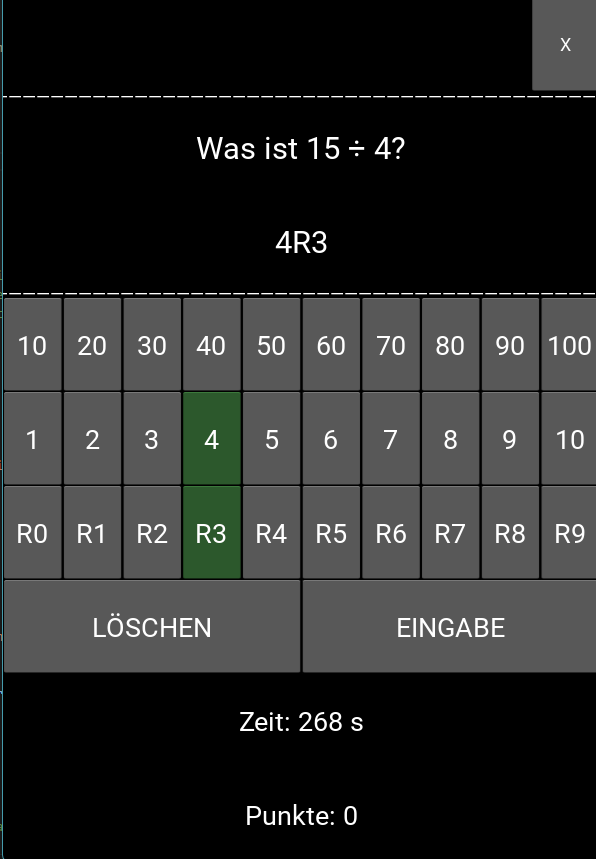

# JonTrain
## Konzept

Diese Grundschulrechentrainer Trainiert das 1x1, als Multiplikation und Division, sowie Division mit Rest.
Es wurde von Grundschülern getestet und ist auf _Lenrspaß_ und _Bedienbarkeit_ optimiert.

Ein besonderes Merkmal ist das Eingabefeld, welches die 10er und die 1er Nummern separat eingebbar macht. Dadurch muss ein Kind sich - wie beim Schreiben - keine Gedanken um die Reihenfolge der Eingabe machen.

## Tester
Danke an Jona, Vincent und Ben fürs Testen!

## Untersützen
Bitte untersützt einfach einen Verein, der sich für Jugenbildung stark macht, z.B. das [Planetarium Laupheim e.V.](www.planetarium-laupheim.de) via [Paxpal Spende](https://www.paypal.com/donate/?hosted_button_id=PND6Y8CGNZVW6)

## Lizenz

[Siehe Lizenz](@License.txt)

Copyright (C) 2025 Arnd Brandes.
 Dieses Programm kann durch jedermann gemäß den Bestimmungen der Deutschen Freien Software Lizenz genutzt werden.